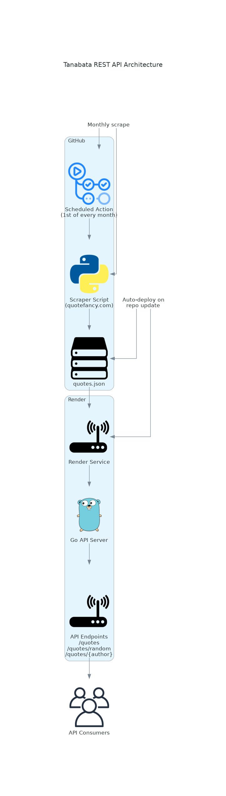

 

> [!IMPORTANT]  
> `Tanabata`'s REST API is ***live*** at [tanabata.onrender.com](https://tanabata.onrender.com/quotes). See the available endpoints [here](#usage).

# `Tanabata`

A small REST API that provides Musician Quotes *(scraped monthly at [quotefancy.com](https://quotefancy.com/))*.

Thrown together over [a Sunday](https://github.com/gongahkia/tanabata/commit/82f11bb336bd2523440523980c79317bd4bc25e8) to practise writing an API Server in Go and to escape from [week 2 of finals](https://github.com/gongahkia/naobito/blob/main/asset/reference/finals.jpg).

## Usage

| API | Description | Example |
| :--- | :--- | :--- |
| `/quotes` | Returns all scraped quotes. | [tanabata.onrender.com/quotes](https://tanabata.onrender.com/quotes) |
| `/quotes/random` | Returns a single randomly selected quote. | [tanabata.onrender.com/quotes/random](https://tanabata.onrender.com/quotes/random) |
| `/quotes/<artist_name>` | Returns all quotes associated with the specified artist. | [tanabata.onrender.com/quotes/Frank%20Ocean](https://tanabata.onrender.com/quotes/Frank%20Ocean) |

## Stack

* *Backend*: [Go](https://go.dev/), [Python](https://www.python.org/)
* *Deploy*: [Render](https://render.com/), [Github Actions](https://github.com/features/actions)
* *Package*: [Docker](https://www.docker.com/)

## Architecture

## Other notes

`Tanabata` is heavily inspired by [kanye.rest](https://github.com/ajzbc/kanye.rest).

## Reference

The name `Tanabata` is in reference to [Tanabata](https://sakamoto-days.fandom.com/wiki/Tanabata) (七夕), a new member of the [Order](https://sakamoto-days.fandom.com/wiki/Order) recruited during the [JAA Jail Arc](https://sakamoto-days.fandom.com/wiki/JAA_Jail_Arc). He emerges as an antagonist in the [New JAA Arc](https://sakamoto-days.fandom.com/wiki/New_JAA_Arc) as part of the ongoing manga series [Sakamoto Days](https://sakamoto-days.fandom.com/wiki/Sakamoto_Days_Wiki).

