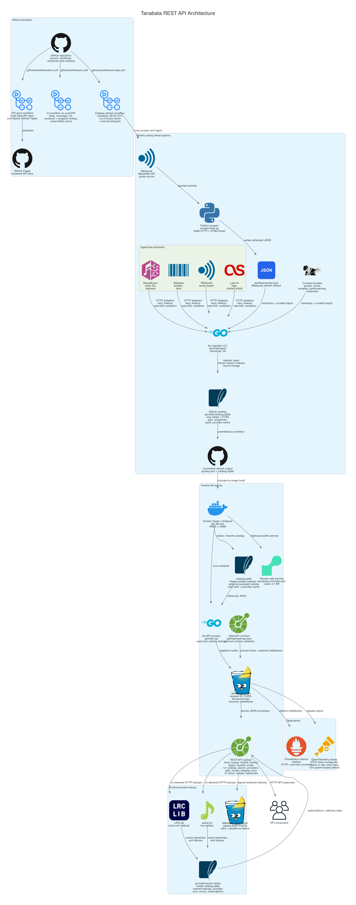

[](https://github.com/gongahkia/tanabata/releases/tag/1.0.0) 


> [!WARNING]  
> [`Tanabata`](https://github.com/gongahkia/tanabata)'s Render deployment is inactive as of 1 June 2025.  

# `Tanabata`

A small REST API that provides Musician Quotes *(scraped monthly at [quotefancy.com](https://quotefancy.com/))*.

Thrown together over [a Sunday](https://github.com/gongahkia/tanabata/commit/82f11bb336bd2523440523980c79317bd4bc25e8) to practise writing an API Server in Go and to escape from [week 2 of finals](https://github.com/gongahkia/naobito/blob/main/asset/reference/finals.jpg).

## Stack

* *Backend*: [Go](https://go.dev/), [Python](https://www.python.org/), [SQLite](https://sqlite.org/)
* *Deploy*: [Render](https://render.com/), [Github Actions](https://github.com/features/actions)
* *Package*: [Docker](https://www.docker.com/)

## Usage

> [!IMPORTANT]  
> `Tanabata`'s REST API is ***live*** at [tanabata.onrender.com](https://tanabata.onrender.com/quotes). See the available endpoints [here](#usage).

| API | Description | 
| :--- | :--- | 
| `/health` | Service health plus snapshot metadata. |
| `/quotes` | Legacy endpoint that returns all scraped quotes. | 
| `/quotes/random` | Legacy endpoint that returns a single randomly selected quote. | 
| `/quotes/<artist_name>` | Legacy endpoint that returns all quotes associated with the specified artist. |
| `/v1/artists` | List or search artists. Supports `q`, `mbid`, `wikiquote_title`, `tag`, `limit`, `offset`. |
| `/v1/artists/{artist_id}` | Fetch one artist. |
| `/v1/artists/{artist_id}/quotes` | Quotes scoped to one artist. Supports `q`, `tag`, `source`, `provenance_status`, `limit`, `offset`, `sort`. |
| `/v1/artists/{artist_id}/related` | Related artists from catalog data. |
| `/v1/artists/{artist_id}/releases` | Releases imported from MusicBrainz. |
| `/v1/artists/{artist_id}/setlists` | Live setlist.fm passthrough when `SETLISTFM_API_KEY` is configured. |
| `/v1/quotes` | Global quote listing. Supports `artist`, `artist_id`, `q`, `tag`, `source`, `provenance_status`, `limit`, `offset`, `sort`. |
| `/v1/quotes/random` | Random quote with the same filters as `/v1/quotes`. |
| `/v1/quotes/{quote_id}` | Fetch one quote. |
| `/v1/sources/{source_id}` | Fetch one source record. |
| `/v1/search?q=...` | Combined artist and quote search. |
| `/v1/stats` | Catalog counts and provider metadata. |

Alternatively, run `Tanabata` locally with the below.

```console
$ make test
$ make run
$ make ingest
$ make ingest-artist ARTIST="<artist_name>"
```

## Architecture



## Other notes

`Tanabata` is heavily inspired by [kanye.rest](https://github.com/ajzbc/kanye.rest).

## Reference

The name `Tanabata` is in reference to [Tanabata](https://sakamoto-days.fandom.com/wiki/Tanabata) (七夕), a new member of the [Order](https://sakamoto-days.fandom.com/wiki/Order) recruited during the [JAA Jail Arc](https://sakamoto-days.fandom.com/wiki/JAA_Jail_Arc). He emerges as an antagonist in the [New JAA Arc](https://sakamoto-days.fandom.com/wiki/New_JAA_Arc) as part of the ongoing manga series [Sakamoto Days](https://sakamoto-days.fandom.com/wiki/Sakamoto_Days_Wiki).


